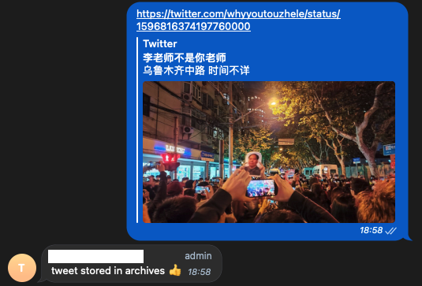

# TweetArchiver Telegram Bot Service

Telegram Bot to archive tweets on the hard drive of the docker host. Useful for media agencies and enthusiastic journalists.
(!) Note: This package is quickly written and works. The code quality is naïvely written, potentially readable but not high standard.

## How does it work

After creating a bot and connecting this service to it, you send a link to a tweet to the bot: 



The bot creates a folder with the date and ID of the tweet and downloads the message, metadata and the containing media on the volume of the service host (a.k.a. your server).

An example for the message and metadata:

```json
{
    "id": "1596816374197760000",
    "created_at": "Sun Nov 27 10:41:05 +0000 2022",
    "description": "乌鲁木齐中路 时间不详 https://t.co/Jcniv7YiTv",
    "isMedia": true,
    "favorite_count": 2879,
    "retweet_count": 237,
    "reply_count": 309,
    "quote_count": 48,
    "isImage": true,
    "media_url": [
        {
            "url": "https://pbs.twimg.com/media/FikH0-3XoAAVerD.jpg",
            "content_type": "img/jpg"
        }
    ]
}
```

## Prerequisites

1. You need a Telegram bot. See the official [Telegram documentation](https://core.telegram.org/bots#how-do-i-create-a-bot) for a guide how to create a telegram bot.
2. You will get the bot token by the `@botfather`. Copy it since you'll need it for the docker compose below. 

## Start the tweetarchiver service (a.k.a. Docker container)

Run it as docker container by starting the docker-compose below:

Example:
```yaml
---
version: "3.7"

services:
  tweetarchiver:
    image: ghcr.io/xu-chris/tweetarchiver/tweetarchiver:latest
    container_name: tweetarchiver
    volumes:
      - ./archive/:/app/archive/
      - ./db/:/app/db/
    restart: unless-stopped
    network_mode: host
    environment:
      BOT_TOKEN: "YOUR_TOKEN"
      PUID: 100
      PGID: 100
```

## Why?

Many Tweets might not resonate with our opinion but they're worth to store for documentation or investigative purposes. In the case above it was about the protests in China 2022 against the COVID-19 measures. Since Twitter is tumbling, the credible information might disappear, getting blocked or simply deleted otherwise.

## Contribute

If you like this but you miss something, please create [issues](https://github.com/xu-chris/tweetarchiver/issues) or contribute via merge requests.